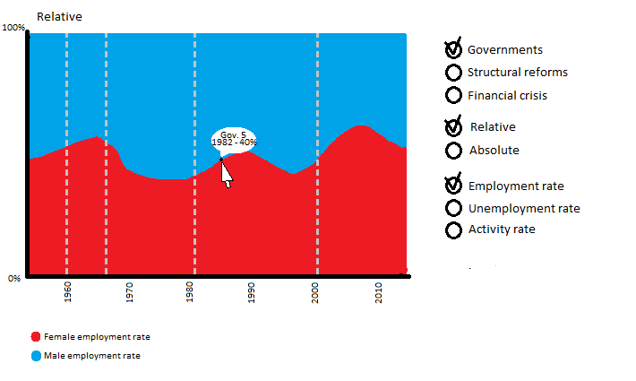
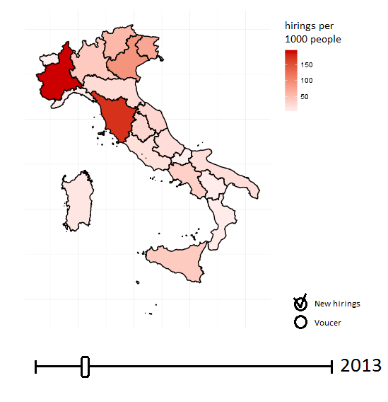
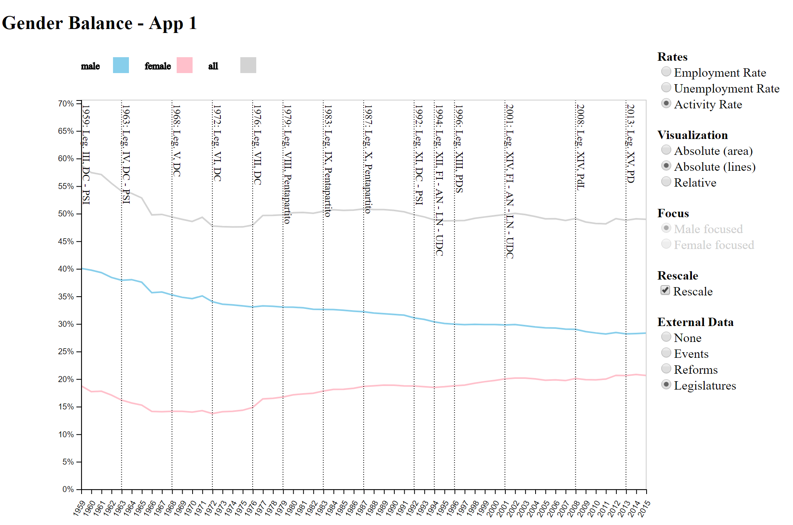

# Data visualization project 
## by Federico Bozzini and Federico Semprini

We decided to build two apps, the first one focusing on some relevant job market rates, their evolution through time and differences between genders; the second one focusing on the regional differences in hirings, voucher usage, terminations and other relevant economic measures of the job market.

## Run instructions

We suggest to use [Docker](https://www.docker.com/) to run the application, but a simple Python interpreter is enough.

With Docker the command to start the application is:

    docker-compose up -d

Alternatively with Python 2:

    python -m SimpleHTTPServer

Or with Python 3:

    python -m http.server

And then browse to:

    [http://localhost:8080](http://localhost:8080)

A working copy of the project is accessible at:

    [https://federicobozzini.github.io/unige-data-visualization/project/index.html](https://federicobozzini.github.io/unige-data-visualization/project/index.html)

## Analysis of the data

### App 1 - gender balance

To build the app 1 (gender balance) we used the data about the absolute number of people occupied, not occupied and exclued by the Workforce divided by gender from year 1959 to 2015, provided to us by ISTAT. Starting from this data we decided to analyse the job market by calculating some of the most important indexes of the job market: Activity Rate, Employment Rate and Unemployment Rate. Especially we also focused on the possibility of analysing this data both in asbolute and relative terms between the genders.

We also decided to integrate this visualization with some external data about events that may have somehow made an impact on the job market. We decided to use datasets about general events, Italian legislatures and the job reforms.

### App 2 - regional indicators

To build the app 2 (regional indicators) we used the data about the hirings, terminations and voucher usage divided by region and year, from 2013 to 2015. This dataset was provided to us by INPS. Starting from this data we decided to analyse the job market by representing the data for the Italian regions, both compared among themselves and by highliting the regional trend across the years.

We also decided to integrate this visualization with the data about the regional population across the years.

## Concepts

### App 1 - gender balance

For the app 1 we decided to represent the data with an area chart or a line chart, displaying the data relevant to the two genders across the years. We decided to visualize one rate at a time, always using the x axis to display the years and the y axis to represent the rate (as a percentage) across the years. When areas are used there can be a visualization of the absolute rates, by stacking the male and female rates up to the total rate, or of the relative rates, by stacking the male and female proprtion to the total rate (sum always equal to 1). When lines are used the two partial rates are visualized separately and an additional line representing the total rate is added.

On the chart the user should be able to visualize the external events as a timeline (vertical lines dividing the chart in smaller sections among the years from one event to the next one).

It should be possible to rescale the data to let the user better understand the rate trends at a glance. It should be also possible to focus the visualization on males or females (by putting them on the bottom of the stacking).

A basic mockup of the app:

### App 2 - regional indicators

For the app 2 we decided to represent the data with two charts. The first one should be a choropleth map that displays the regional selected indicators. The second one should be a bar chart displaying the indicator trends across the years for a region or for the whole country.

It should be possible for the users to visualize the data both in absolute terms and weighted on the population of each region.

We also decided to add as an indicator the ratio between the hirings and terminations. This may offer an interesting overview of the health status of a local job market.

A basic mockup of the app:

## Data pre-processing

All the code used for the pre-processing of the data is included in the file *extractData.js*. The language used is *javascript*, on the *node.js* platform. To extract the data from the Excel files we used the [xlsx library](https://www.npmjs.com/package/xlsx).

To run the scripts, the first step is to install the dependencies:

    /bin/npm install

The second step is just to run the *extractData.js* script.

    /bin/node extractData.js

### App 1 - gender balance

To read the data for the app 1 we opened the file *01_ISTAT, Forze di lavoro per anno, 1959-2015.xls* and transformed it into a json structure that was then filtered and mapped to produce a json with the data about the males and females occupied, not occupied and excluded by the workforce for each year from 1959 to 2015. 

### App 2 - regional indicators

To build app 2 we needed to gather regional data of: hiring, terminations and total population.
Hirings and terminations have been extracted from the file *03_MINLAV, Avviamenti e cessazioni, Italia, 2013-2016 (elaborazioni).xlsx*, the data then has been transformed splitting it per year and grouping data of Trentino alto adige. The total population has been extracted from the ISTAT website and transformed to match the format of the other dataset.

## Functionalities

### App 1 - gender balance

The app 1 offers to the user an interface to explore the most relevant job market rates in several different ways.

The main interaction a User can make with the application are:

- the user may change the rate visualized with a radio button. The rates that can be selected are "employment rate", "unemployment rate" and the "activity rate". Employment Rate is calculated as the ratio between the occupied population and the total population, the Unemployment Rate is calculated as the ratio between the not occupied population and the Workforce, the Activity Rate is calculated as the ratio between the workforce and the total population.

- the user may change the visualization with a radio button. The possible visualizations are "absolute (area)", "absolute(lines)" and "relative"). The absolute with areas means that the rates are represented as stacked areas, each one representing one gender, that sum to the total rate. The absolute with lines, means that the rates are rapresented with 3 lines, one for each gender and one for the total rate. The relative rate means that the two rates (one per gender) are represented as stacked areas always summing to 100% and only the proportion is shown.

- the user may change the Focus with a radio button. The focus may be on the male population or the female one. Focus means that the selected gender appears on the bottom of a stacked chart. This options is disabled when the visualization "absolute (lines)" is selected.

- the user may activate the rescaling with a check box. Rescaling means that the rates are zoomed on the y axis, so that the total is no more 100% if this is not relevant to the rates visualized (because they are much lower).

- the user may select some external data to plot, with a radio button. The external data include "events", "reforms" and "legislatures". Events means some political or economic events that may have influenced the job market (divorce law introduction, abortion law introduction, introduction of the euro). Reforms means the main job market reforms introduced regarding the job market. Legislatures is self-explanatory. When some external data are selected, they are represented as a timeline, so with labeled vertical lines.

## Specific implementation techniques

### App 1 - gender balance

To complete the application 1 the main technique the we used that were novel for us, was the *d3.stack* tools, to plot a stacked area chart using the full capabilities of *d3.js*. We also got a much better understing of [grouping vs non-grouping selection](https://bost.ocks.org/mike/selection/).

### App 2 - regional indicators

## Technical requirements

The applications use some advanced javascript features (promises, async/await, spread syntax, arrow functions) and so a modern broswer is required to use the applications.

We suggest chrome 59, but it works on all modern broswer according to this compatibility table:

| Browser | Min version |
|---------|-------------|
| Chrome  | 55          |
| Firefox | 52          |
| Edge    | 20          |
| Opera   | 42          |
| Safari  | 10.1        |